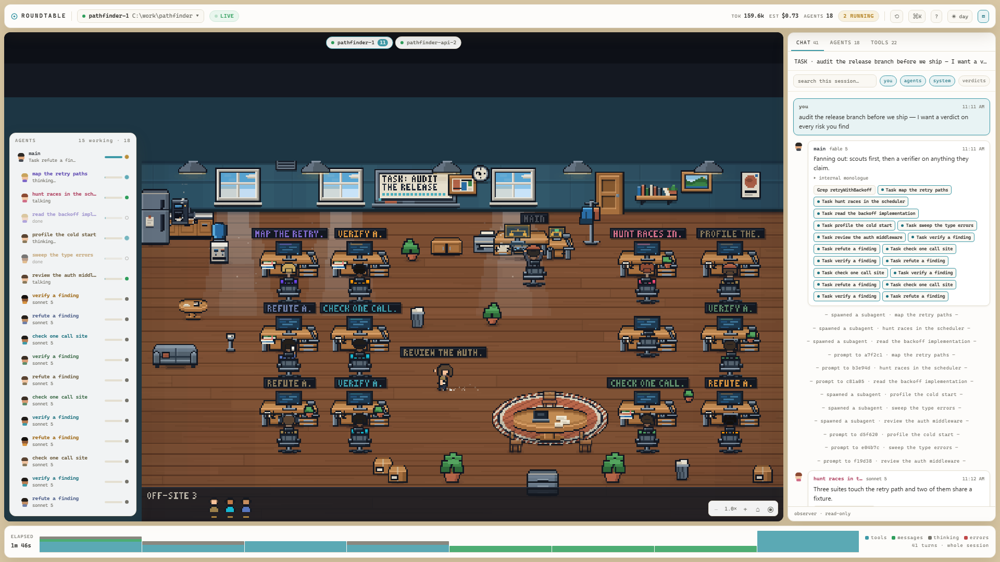

# Roundtable

Watch your Claude Code sessions as an office. Every agent is a person at a desk: they think, run
tools, walk over to each other to deliver a result, argue about a verdict, and go and sit in the
break corner when they finish. The same events are in a group chat beside the room, in words.

It is **read-only**. It watches the transcript files Claude Code already writes under `~/.claude`
and never writes to them, never talks to the API, and never leaves your machine.

### See it first

**[▶ media/roundtable-trailer.mp4](media/roundtable-trailer.mp4)** — 52 seconds, no narration, showing
the whole thing: agents arriving, a red `REFUTED` and a green `CONFIRMED`, the timeline rewinding the
room to an earlier second, two sessions in tabs, and the per-agent token and cost breakdown. Captions
are burned in, and `media/roundtable-trailer.srt` has them as text.

Every frame is the real application driven by real events — only the *content* of the transcripts is
synthetic, so that no private session appears in it. `scripts/promo/` is the harness that filmed it.



```
npm install
npm start
```

That is the whole thing. It opens `http://localhost:5173` and starts showing whatever session ran
most recently. If you have a session running right now, you are watching it live.

### The desktop icon

```
npm run desktop
```

Puts a **Claude Agents** shortcut on the Desktop. Clicking it starts the observer if it is not
already up, opens the room in your browser, brings Claude Code up to date, and hands the window over
to a Claude session — so one click gets you both halves of what you were going to open anyway.

Clicking it twice is safe: the servers are only started when nothing is listening on their ports, so
a second click just opens another tab and another session. The servers get their own minimized
window called *Roundtable servers*, which is where to look if something does not come up and what to
close when you are finished.

The session starts in your home directory, because that is where sessions normally run and so it is
the one the observer opens on. `$StartIn` at the top of `desktop\claude-agents.ps1` changes that.
`desktop\claude-agents.ps1 -SkipClaude` does everything except open the session, which is how to
check the shortcut without spending one.

The icon is drawn by `scripts/desktopIcon.mjs` rather than checked in as an opaque binary — edit the
geometry there and re-run `npm run desktop`. If you move or rename the project, re-run it too: the
shortcut points into the checkout.

---

## What you are looking at

```
┌──────────────────────────────────────────────────────────┬──────────────┐
│ ROUNDTABLE  ▾ session   ● LIVE      TOK  EST  AGENTS  ⟲ ⌘K ◐ ▤        │
├──────────────────────────────────────────────────────────┼──────────────┤
│                                                          │  CHAT        │
│   the office — one person per agent                      │  AGENTS      │
│                                                          │  TOOLS       │
│   ┌─────────┐                                            │              │
│   │ AGENTS  │  roster rail: who is here, what they are   │  the same    │
│   │  ·····  │  doing, how many tokens they have spent    │  events, in  │
│   └─────────┘                                            │  words       │
├──────────────────────────────────────────────────────────┴──────────────┤
│ ELAPSED  ▁▃▅▂▇▃▁▂▅▃▁  activity, one bar per second — click to rewind     │
└─────────────────────────────────────────────────────────────────────────┘
```

**The room.** Each agent walks in through the door and takes a desk. Working at a desk means a tool
is running; a thought bubble is a real `thinking` block; walking to someone and speaking is that
agent reporting a result. A red bubble is a `REFUTED` verdict, a green one `CONFIRMED`. When an
agent finishes it gives up its chair — so somebody waiting outside can have it — and goes to sit in
the corner for a couple of minutes before heading home. So the corner filling up tells you work is
landing, and the room a few minutes later is only the people still working. Whoever has left is
still in the **AGENTS** panel with their tokens, their cost and everything they said.

If one of them turns out not to have finished after all — which happens, because a background agent
is reported done the moment it is *launched* — it walks back in through the door and takes a desk
again.

If more agents are running than the room has chairs, the extra ones appear as small heads along the
bottom. They are real: you can hover, tab to and click them.

**The top bar.** `TOK` is every token the session has billed, cache included. `EST` is a cost
estimate from published list prices — a `≥` in front means some model in the session has no rate
card in `shared/models.ts`, so the figure is a floor rather than a total.

**The timeline.** One bar per second of the session. Click one — or tab to it and use the arrow
keys — and the whole room rewinds to that moment and stops. The office is deterministic, so this
rebuilds the room as it actually stood, not an approximation. Press `Escape` or the `RESUME LIVE`
button in the top bar to come back to now.

---

## More than one session at a time

When two or more sessions are **running**, a strip of tabs appears over the room, one per session.
Clicking a tab shows that session's room, roster, feed and totals. Nothing is thrown away when you
switch: every room keeps running in the background, so switching back is instant and complete.

"Running" is the same thing the dot in the picker means — the CLI has the session registered and
something touched it inside the last 90 seconds. A tab carries a count only when that session has
agents actually working, so a busy session and an idle one are still told apart at a glance. With
one session running, or none, there is no strip at all; there would be nothing to choose between.

**New sessions are picked up automatically.** The hub sweeps for them every few seconds — start a
session in another window and its tab appears on its own. The `⟲` button in the top bar asks it to
look *now* rather than on its own schedule; it is there so you do not have to wonder whether it is
working.

To watch a session that is *not* running — anything you have ever run on this machine — use the
session picker in the top bar, or press `⌘K` and start typing its name.

---

## Keys

| | |
|---|---|
| `⌘K` / `Ctrl+K` | command palette — every action, plus every agent and session by name |
| `1` `2` `3` | chat / agents / tools panel |
| `B` | show or hide the side panel |
| `T` | day → night → follow the system |
| `Escape` | close the palette, then resume live, then clear the selection |
| arrows | pan the room; `+` / `-` zoom; `Home` re-centres |
| arrows on the timeline | move along it; `Enter` rewinds the room to that second |

Clicking a person focuses them: the feed filters to their turns and everyone outside their spawn
tree dims. Clicking the **whiteboard** opens the session's feed; clicking the **roundtable** filters
the feed to just the verdicts agents gave each other.

---

## If something looks wrong

**`OFFLINE` in the top bar.** The hub is not running. `npm start` runs both halves; if you started
only Vite, the page has nothing to connect to.

**"port 7411 is already in use".** Roundtable is already running in another terminal. Open
`http://localhost:5173` instead of starting a second copy.

**Vite refuses to start because 5173 is busy.** That is deliberate. The hub only accepts WebSocket
connections from `localhost:5173` and `:4173` — that check is the only thing stopping any other page
you have open from reading your transcripts. If Vite quietly moved to 5174 the app would look
completely normal and never connect.

**The feed says lines were dropped, or that the tail is incomplete.** Both are true statements, not
glitches: a transcript line over 1 MiB cannot be parsed and is stepped over (any tool call answered
on such a line will never show a result), and a very large transcript is still being read. The feed
says so rather than quietly showing you less than there is.

---

## Development

```
npm run dev          # same as start, without opening a browser
npm test             # 340 unit tests
npx tsc --noEmit     # types
npm run e2e          # Playwright — needs 7411 and 5173 free, so stop `npm start` first
npm run room         # render the office to .preview/room-{day,night,spawn}.png
npm run room:bless   # accept a deliberate visual change as the new baseline
```

`npm run e2e` starts its own hub on 7411, so it cannot run at the same time as the app. Stop the app
by **port**, not by killing the `npm` wrapper — the two servers outlive it.

Architecture, in one paragraph: `server/tail.ts` tails each JSONL file by byte offset →
`server/parse.ts` tolerantly parses a line → `server/normalize.ts` turns it into typed events →
`server/hub.ts` watches the filesystem, derives cross-file events like "that subagent finished", and
broadcasts over a loopback WebSocket gated on `Origin` → `src/ws.ts` batches frames → `src/store.ts`
folds them into one `RtState` per session → the panels render that, while `src/office/mapping.ts`
turns the same events into commands for the deterministic simulation in `src/office/engine.ts`,
which `src/office/pixel/scene.ts` paints into a 480×270 buffer. `shared/` holds the wire types and
is the only thing both halves import.

`docs/pixel-contract.md` is binding for anything under `src/office/pixel/`.
